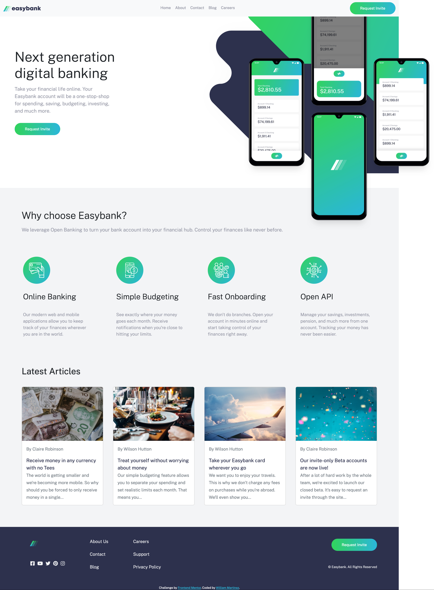

# Easybank landing page

This is a solution to the [Easybank landing page challenge on Frontend Mentor](https://www.frontendmentor.io/challenges/easybank-landing-page-WaUhkoDN). Frontend Mentor challenges help you improve your coding skills by building realistic projects.

## Table of contents

- [Overview](#overview)
  - [The challenge](#the-challenge)
  - [Screenshot](#screenshot)
  - [Links](#links)
- [My process](#my-process)
  - [Built with](#built-with)
  - [What I learned](#what-i-learned)
  - [Continued development](#continued-development)
- [Author](#author)

## Overview

### The challenge

Users should be able to:

- View the optimal layout for the site depending on their device's screen size
- See hover states for all interactive elements on the page

### Screenshot

### Links

- Solution URL: [https://github.com/williamm275/easybank-landing-page](https://github.com/williamm275/easybank-landing-page)
- Live Site URL: [https://williamm275.github.io/easybank-landing-page/](https://williamm275.github.io/easybank-landing-page/)

## My process

I decided to use Bootstrap to assist me in creating a responsive navbar and cards. To make sure all elements within my website were structured well I used Flexbox. 

### Built with
- HTML
- CSS
- Bootstrap

### What I learned

I learned new techniques when using Bootstrap such as muted text.

### Continued development

Creating a collapse menu when on a smaller device is something I need to work on. I found the best way to create it was to hide the button within the nav when the device is small but it only works on Desktop and you can still see the button disappear. I would like to learn new, efficient and quicker ways to layout elements on a page. I also would like to find a more responsive way to place transparent images within a container in a specific position while still resizing with the window or device size.

## Author

- Website - [William R. Martinez](https://willrmartinez.com)
- Frontend Mentor - [@williamm275](https://www.frontendmentor.io/profile/williamm275)
- Twitter - [@williamm275](https://www.twitter.com/williamm275)